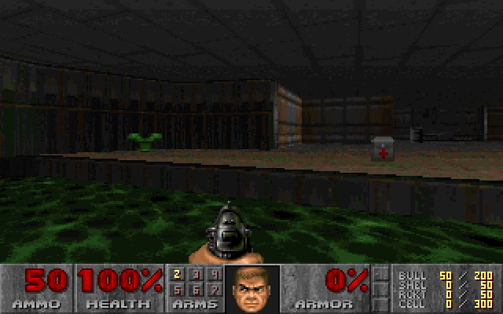
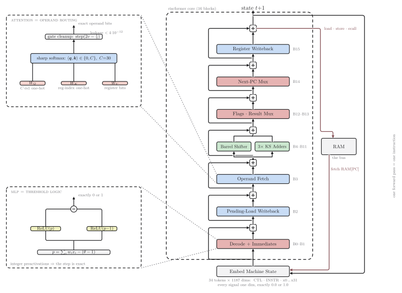

# riscformer

A transformer that **is** a CPU. Not a language model that predicts what a CPU
might do — a real transformer (multi-head softmax attention + ReLU MLPs +
residual stream) whose weights are **constructed analytically** so that one
forward pass executes exactly one RV32I instruction, bit-exactly. It runs
real, unmodified RISC-V binaries compiled with GCC — including Doom.



*Attract-mode demo, 54.7M instructions in: the full 3D software
renderer — BSP traversal, fixed-point texture mapping (soft-multiplied,
rv32i has no MUL), sprites, status bar — executing on attention heads and
threshold-logic MLPs. The [title screen](docs/title.png) appears at 13.6M
instructions.*

Why constructed rather than trained: Doom executes millions of instructions
per frame. A learned model with even 99.999% per-instruction accuracy is
mathematically guaranteed to derail. Exactness has to come from the
architecture, not from fitting.

## How it works



*One forward pass executes one instruction. Attention layers (blue) route
operands between tokens; MLP layers (red/green) are threshold-logic circuits.
The zoom panels show the two constructions that make it exact. Source:
`docs/arch.tex` (TikZ); rebuild with `docs/build.sh` (needs tectonic +
poppler).*

**Tokens = machine state.** 34 tokens: one control token (PC + pending-load
record), one instruction token (instruction word in, all decode/ALU work),
and 32 register tokens (index one-hot + 32 value bits). Every logical signal
is one residual dimension holding exactly 0.0 or 1.0 (d_model = 1187).

**Attention = operand routing.** Register fetch is a query "rs1 == your
index?" from the instruction token against register-token keys; softmax with
sharp logits (C=30) makes it exact routing (leakage < 4e-12, squashed by the
next gate). Writeback is the mirror image: each register token queries
"rd == me?" with a self-attention fallback so unaffected registers keep their
value. Four attention layers total: pending-load writeback, rs1/rs2/PC fetch,
register writeback.

**MLPs = logic gates.** Every gate is a linear-threshold unit made exact by a
step function built from two ReLUs: `step(p) = relu(p) - relu(p-1)`, which is
*exactly* 0 or 1 for integer-valued pre-activations. On top of that: a full
instruction decoder, immediate assembly for all 5 formats, three parallel
32-bit Kogge-Stone carry-lookahead adders (ALU, branch target, PC+4), a 5-stage
barrel shifter, signed/unsigned comparators, and the result/next-PC muxes.
16 blocks, one instruction per forward pass, 18.2M parameters (99.4% zeros).

**Memory = the bus.** The transformer computes addresses and store data; the
harness is only motherboard wiring: it fetches RAM[PC] into the instruction
token, services the load/store the core emitted, and feeds the output state
back in — autoregression over machine steps. Loads use an internalized
load-delay slot (the "pending load" record), architecturally invisible.

## Verification

`tests/test_core.py` runs the transformer differentially against a reference
RV32I emulator: after **every instruction**, PC and all 32 registers must
match exactly. Covers ALU torture with adversarial values, signed/unsigned
compares, sub-word memory + sign extension, load-use hazards, branches,
function calls, x0 immutability. `verify_doom.py` extends this to the real
Doom binary: the first 1.5M instructions of the boot are bit-identical,
including all syscall traffic.

## Execution engines

- `harness.py` — numpy, the model as literal dense matrices (~180 instr/s).
- `tcpu/engine.c` — identical forward pass with sparse weight storage and
  activation-sparsity tracking (~10-17k instr/s). Verified equivalent.
  (The constructed weights are 99.4% zeros; the C engine stores them sparse
  but computes the same math.)

## Quick start

Needs [uv](https://docs.astral.sh/uv/) and a C compiler.

```sh
uv sync
uv run pytest              # differential verification suite
uv run python run_demo.py  # hello world on the numpy transformer
```

## Doom

`doom/` contains a bare-metal rv32i port of [doomgeneric]: custom mini-libc,
ecall semihosting bridge (file IO for the WAD, console, clock, keys,
framebuffer doorbell), linker script, boot stub.

```sh
brew install riscv64-elf-gcc riscv64-elf-binutils p7zip

./doom/fetch_assets.sh        # clones doomgeneric, fetches shareware WAD
./doom/build.sh               # cross-compiles doom.bin for rv32i
uv run python doom_run.py     # boots Doom on the transformer
uv run python doom_gif.py     # assembles saved frames into a GIF
```

Frames are rendered by the game inside the transformer CPU (320x200, 8-bit,
palette from the WAD's own PLAYPAL) and saved as PNGs in `doom/frames/`.
Boot to the title screen is ~13.6M instructions (~20 minutes).

[doomgeneric]: https://github.com/ozkl/doomgeneric

## Layout

```
tcpu/build.py    weight-construction framework (gates -> ReLU pairs,
                 routing channels -> attention matrices)
tcpu/core.py     the RV32I microarchitecture, block by block
tcpu/nn.py       plain transformer runtime (numpy)
tcpu/engine.c    fast sparse execution engine (same math)
rv32/ref.py      reference emulator (ground truth)
rv32/enc.py      instruction encoders for tests
harness.py       numpy machine harness
doom_run.py      Doom host: ecall services + frame capture
verify_doom.py   lockstep transformer-vs-reference run of the Doom binary
doom/port/       doomgeneric platform layer + mini-libc for rv32i
tests/           differential test suite
```

## Roadmap

- M extension (hardware multiply/divide in the residual stream) — Doom on
  rv32i soft-multiplies ~200 instructions per `FixedMul`; a constructed
  multiplier is a 5-15x speedup on rendering.
- Keyboard input scripting over the ecall bridge to actually *play* it.
